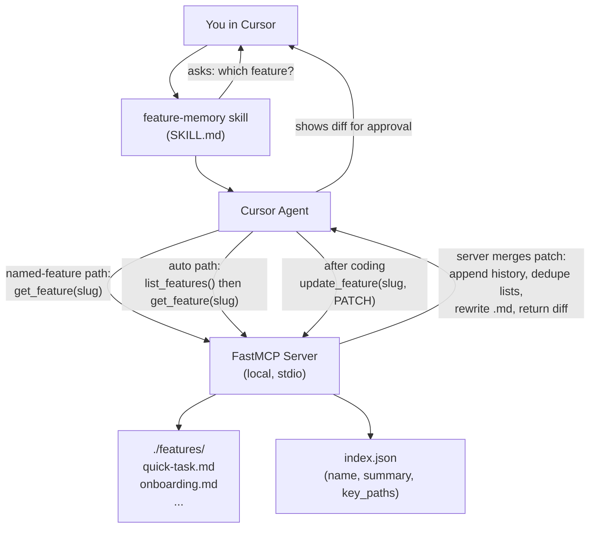

# Feature Memory MCP — Design Spec (V1)

**Status:** Approved (2026-04-23)
**Owner:** Rafael Sakera
**Scope:** Personal local MVP (single user, single machine). Designed git-syncable for future team sharing.

---

## Problem

When working in Cursor, Rafael repeatedly trains specialized agents on individual product features (e.g., "Quick Task" — a 17K-line Angular→React migration). Each chat session loses that context. Knowledge is fragmented across many short-lived agent instances on his machine and on his teammates' machines.

The dream: a shared memory layer where the agent fetches feature expertise *before* planning and writes back what changed *after* implementation, so the team's collective knowledge accumulates instead of decaying.

The pitfall (flagged during brainstorming): treating this as "a folder of markdown summaries" makes the docs go stale, retrieval fuzzy, and the agent hallucinates anyway. The real product is a **structured, append-merge knowledge system**, not a docs dump.

---

## Goals (V1)

- A local MCP server the agent can call from any Cursor session.
- One markdown file per product feature, human-readable and git-tracked.
- A Cursor skill that drives the before/after workflow automatically.
- Updates are **patches**, not rewrites — the agent can only add knowledge in normal flow, never accidentally delete it. Corrections (removals + archive) are available but skill-gated to explicit user requests.
- Zero hosting cost. Zero embedding infrastructure. Inspectable by hand.

## Non-Goals (V1)

- Embeddings / vector search (deferred — see Upgrade Path).
- Web UI / feature graph visualization.
- "Chat with your product" support bot.
- Cross-machine auto-sync server (manual `git push` is the sharing mechanism for now).
- Auto-detection from git diff.
- Authentication / multi-user merging.

---

## Section 1 — Architecture

A **local Python MCP server** maintains a markdown-based knowledge base. Cursor agents call it via a **Cursor skill** at two moments: before planning (load expert context) and after implementation (apply a patch).



**Key properties:**

- **No embeddings in V1.** The agent picks from a small index of `[{slug, name, summary, key_paths, tags}]`. For <200 features this fits trivially in context. Smarter than embedding-based retrieval at small scale because the agent uses the full prompt + open files, not just a query string.
- **Markdown is the source of truth.** Human-readable, git-diffable, editable by hand if needed.
- **`index.json` is derived.** Auto-rebuilt from frontmatter on every write. Never edited by hand.
- **Local stdio MCP.** Configured once in `~/.cursor/mcp.json`. No hosting.
- **Agent sends typed patches, not rewrites.** The server is the only writer of feature files. The agent's default after-coding tool (`update_feature`) can only ADD fields via a typed patch object. Removals exist only via a separate `correct_feature` tool that the skill rules forbid the agent from calling unless the user explicitly requests a correction. This makes "the agent silently lost a gotcha" structurally impossible in normal flow.
- **Designed git-syncable.** When you want to share with the team, you push the `features/` repo. No backend changes needed.

---

## Section 2 — Data Model (Markdown + YAML Frontmatter)

One file per feature: `features/<slug>.md`.

Example (`features/quick-task.md`):

```markdown
---
name: Quick Task
slug: quick-task
summary: Lightweight tasks users create and assign during onboarding and from the dashboard.
key_paths:
  - src/quick-task/**
  - api/quick-task/**
dependencies:
  - onboarding
  - user-profile
tags: [tasks, react-migration]
created_at: 2026-04-23
updated_at: 2026-04-23
---

## Overview
What this feature is, who uses it, why it exists.

## Architecture
Key components, services, stores. Frontend/backend split.

## Flows
- User creates task during onboarding -> stored in quick_tasks table -> appears in dashboard.
- ...

## Gotchas
- Legacy Angular logic still exists in legacy/quick-task-old.controller.js.
- React migration incomplete for the edit flow.

## History
- 2026-04-23 - rafael - Migrated edit flow to React (PR #1234).
- 2026-03-15 - rafael - Initial extraction from monolith.
```

**Why this shape**

- **Frontmatter = machine surface.** Used to build `index.json`, filter by tag, link dependencies.
- **Body = agent surface.** Injected into context to make the agent an "expert".
- **Standard sections** (`## Overview`, `## Architecture`, `## Flows`, `## Gotchas`, `## History`) make merge logic predictable. The skill always knows where new flows or gotchas go.

**Frontmatter fields**

- `name` (string, required) — Human-readable display name.
- `slug` (string, required) — URL-safe id, derived from name on `create_feature`.
- `summary` (string, required) — One line, ~15 words. Shown in the index.
- `key_paths` (string[], required) — Glob patterns matching feature files. Used by the auto-detect path.
- `dependencies` (string[], optional) — Slugs of other features this one depends on.
- `parent_feature` (string, optional) — Slug of the parent feature, if this is a sub-feature (e.g., `quick-task-editing` -> `parent_feature: quick-task`). Lets you split a feature once it grows too large without losing the link.
- `tags` (string[], optional) — Free-form labels.
- `created_at` (YYYY-MM-DD, required) — Auto-set on `create_feature`.
- `updated_at` (YYYY-MM-DD, required) — Auto-bumped on every successful `update_feature`.

### Severity convention for flows and gotchas

To avoid "everything looks equally important," items in `## Flows` and `## Gotchas` may be prefixed with `[CRITICAL]` (one tier only — three tiers invites inflation):

```
## Gotchas
- [CRITICAL] Bulk import bypasses the audit log - never expose this endpoint publicly.
- Legacy Angular logic still exists in legacy/quick-task-old.controller.js.
```

The skill rule (Section 4) requires the agent to **explicitly surface `[CRITICAL]` items** in any plan it produces, separate from the rest of the injected context.

---

## Section 3 — MCP Server Tool Contracts

Six tools, split into two groups.

### Group 1 — Default tools (used in normal before/after-coding loops)

#### `list_features() -> Feature[]`

Returns the full index. Each entry: `{ slug, name, summary, key_paths, tags }`. Used **only on the auto-detect fallback path** (when the user doesn't name a feature).

#### `get_feature(slug: str) -> FullFeature`

Returns one full feature: `{ frontmatter, body_markdown }`. Called 1–N times once the feature(s) are identified.

#### `update_feature(slug: str, patch: FeaturePatch) -> { ok: bool, diff: str, warnings: str[] }`

Append-and-merge. Called AFTER coding with a small **patch object** (NOT a full rewrite).

`FeaturePatch` accepts:

- `summary_override?: str` — only field that overwrites a frontmatter scalar; default is no change.
- `add_flows?: str[]` — appended to `## Flows`, deduped by exact string match.
- `add_gotchas?: str[]` — appended to `## Gotchas`, deduped.
- `add_dependencies?: str[]` — appended to frontmatter `dependencies`, deduped.
- `add_key_paths?: str[]` — appended to frontmatter `key_paths`, deduped.
- `set_parent_feature?: str` — sets/changes `parent_feature` (one of the few overwritable scalars; null clears it).
- `history_entry: { date, author, change }` — **required**, never overwritten.
- `notes_append?: str` — freeform markdown appended to body (after `## History`).

Returns:
- `diff` — unified diff so the agent can show the user what changed.
- `warnings` — non-blocking advisories. The server emits a warning when the feature exceeds soft size limits (default: >25 flows or >40 gotchas), suggesting the user consider splitting into sub-features via `parent_feature`. The write still succeeds.

#### `create_feature(name, summary, key_paths, body) -> { slug }`

Used when the agent determines the work is on a feature that doesn't exist yet. `slug` is derived from `name` (lowercased, hyphenated, ASCII).

### Group 2 — Correction tools (only on explicit user request)

These tools let the user fix mistakes through conversation without leaving Cursor. The skill is strict: **the agent never calls these proactively** — only when the user explicitly says "that's wrong, remove it" / "this feature is gone." Every correction writes a `## History` entry recording what was removed and the user's stated reason.

#### `correct_feature(slug: str, corrections: Correction[]) -> { ok: bool, diff: str }`

Surgical removals. Each correction is one of:

- `remove_flow(text)` — exact-string remove from `## Flows`.
- `remove_gotcha(text)` — exact-string remove from `## Gotchas`.
- `remove_key_path(path)` — exact-string remove from frontmatter `key_paths`.
- `remove_dependency(slug)` — exact-string remove from frontmatter `dependencies`.
- `replace_summary(new_summary)` — overwrite the one-line summary.

Server validates each removal (errors if the exact text doesn't exist), writes a `## History` entry per correction with the user's reason, bumps `updated_at`, returns a unified diff.

For deep prose rewrites (e.g., the `## Architecture` section is wrong), the user still hand-edits the markdown — agents shouldn't rewrite freeform sections.

#### `archive_feature(slug: str, reason: str) -> { ok: bool, archived_path: str }`

Soft delete. Moves `features/<slug>.md` -> `features/_archived/<slug>.md`, removes the feature from `index.json`, and appends a final `## History` entry with the reason. Reversible by hand (move the file back). All knowledge and history are preserved.

### Why no `delete_feature`

Hard deletion is never offered to the agent. `archive_feature` is the strongest soft-delete: it removes the feature from agent retrieval but preserves the audit trail and is git-recoverable. If you truly need to purge a file from disk, do it by hand + `git rm`.

---

## Section 4 — Cursor Skill Workflow

Skill location: `~/.cursor/skills/feature-memory/SKILL.md` (global — available across all repos).

### Before planning — the "expert mode" loop

1. Skill activates on any "implement / build / fix / refactor" intent in the user's message.
2. Skill asks the user: *"Which feature is this for? (Or say 'auto' / 'I don't know' and I'll figure it out.)"*
3. **Named-feature path:** If the user names a feature, the agent skips listing and calls `get_feature(slug)` directly. Saves tokens.
4. **Auto-detect fallback path:** If the user says `'auto'` or doesn't know, the agent:
   - Calls `list_features()`.
   - Ranks the top candidates by matching the user's prompt against each `summary`/`name` AND currently open files against each `key_paths` glob set.
   - **Always shows the ranked candidates to the user with concrete signals (file matches, keyword matches) and asks for confirmation.** The agent never silently auto-picks. Example:
     ```
     Auto-detect found:
       1. Quick Task - 3 of your open files match key_paths, "task" appears in your prompt
       2. Onboarding - 1 file match, no prompt keywords
     Pick one, pick multiple (e.g. "1 and 2"), or say "new feature".
     ```
   - Once the user confirms, agent calls `get_feature(slug)` for each pick.
5. Agent injects the body markdown into its working context. **If any flow or gotcha is prefixed `[CRITICAL]`, the agent surfaces those items explicitly at the top of its plan**, separate from the rest of the context. Then proceeds with planning.

### After implementation — the "update memory" loop

1. When the user signals work is done (PR opened, "we're done", "wrap it up", etc.), the skill prompts the agent: *"Should I update the [feature name] doc with what we just did?"*
2. If the user agrees, the agent constructs a **patch** (a small delta object — NOT a full rewrite):
   - `history_entry` (required, dated, with one-line change description).
   - `add_flows` / `add_gotchas` / `add_dependencies` / `add_key_paths` as needed.
   - `summary_override` only if the summary genuinely needs to change.
   - `notes_append` for richer prose if the change deserves more than a one-liner.
3. **Quality filter (skill rule).** Before sending the patch, the agent compresses and generalizes:
   - Each item must be a **feature-level insight**, not a commit-level change.
   - Reject things like *"fixed button color"* or *"renamed variable foo to bar"* — those belong in the PR description, not the feature memory.
   - Prefer fewer high-quality additions over many low-quality ones.
   - Use `[CRITICAL]` prefix only for items the agent should surface in every future plan (security, data loss, breaking-change risks).
4. Agent calls `update_feature(slug, patch)`.
5. The server merges the patch, rewrites the `.md` file, rebuilds `index.json`, and returns a unified diff plus any size warnings (e.g., "feature now has 26 flows — consider splitting via `parent_feature`").
6. Agent shows the diff and any warnings to the user: *"Here's what I added — looks right? Server also flagged: [warning]."*

### Correction loop — only on explicit user request

The skill exposes `correct_feature` and `archive_feature` to the agent but with strict rules:

- **Never proactively.** The agent must not suggest removals or archival unless the user explicitly says something like "that gotcha is wrong," "remove that flow," "this feature is obsolete," "merge this into X."
- **Always confirm before calling.** Agent restates the planned correction in plain language ("I'll remove the gotcha 'React migration incomplete' and add a history entry — you said because the migration is now complete. Confirm?").
- **One feature at a time.** No bulk archives.
- **Reason is required.** Both tools require a `reason` string that becomes part of the history entry.
- **Deep prose rewrites are out of scope.** If a section like `## Architecture` is wrong, the agent says: "This needs a hand-edit — opening the file." Then proceeds via normal file editing tools (not via the MCP).

After a correction, the agent shows the diff for sanity check, same as the update loop.

### Workflow guarantees

- "Ask user first, fall back to auto-detect" — built into step 2 of the before-planning loop.
- "Auto-detect always confirms before acting" — built into step 4 of the before-planning loop.
- "Agent can only add, never silently delete" in normal flow — built into the patch shape of `update_feature`.
- "Removals require explicit user intent" — built into the skill rules around `correct_feature` / `archive_feature`.
- "[CRITICAL] items are always surfaced in plans" — built into step 5 of the before-planning loop.
- "Patches are quality-filtered before being sent" — built into step 3 of the after-implementation loop.
- "Every change is auditable" — every tool that mutates state writes a `## History` entry.

---

## Section 5 — Update / Merge / Correction Strategy

The biggest risk is staleness from naive overwrites. Secondary risk is mistakes accumulating because they're hard to fix. Defenses for both:

### Default behavior (additive)

1. **Agent sends patches, not rewrites.** `update_feature` only accepts a typed delta. The agent literally cannot send a "new full body" of the file. The worst it can do is add noise — never silently lose existing knowledge.
2. **Server is the only writer.** Only the MCP server reads and writes files in `features/`. The agent never touches disk for feature files (it does still hand-edit prose sections via normal file tools — see exception below).
3. **History is append-only.** Every state-changing tool call adds an entry to `## History`. Never deleted.
4. **Lists merge by deduplication.** `add_flows`, `add_gotchas`, `add_dependencies`, `add_key_paths` dedupe by exact string match. Conflicting wordings surface as duplicates the user can clean up manually.
5. **Scalars are not overwritten by default.** `summary` only changes if the agent passes `summary_override` (in `update_feature`) or `replace_summary` (in `correct_feature`). `name` and `slug` never change after creation.
6. **`updated_at` is automatic** on every successful state change.
7. **Server returns a unified diff** so the agent can show the user what changed before moving on.

### Correction behavior (explicit-intent only)

8. **`correct_feature` is gated by skill rules.** The agent only calls it when the user explicitly says something is wrong. Skill prompts the agent to confirm in natural language before the call.
9. **Removals are exact-match.** Server errors out if `remove_flow("X")` is called and "X" isn't currently in the list. Prevents silent no-ops.
10. **Every removal records a history entry** with the user's stated reason.

### Archive vs hard-delete

11. **`archive_feature` is the strongest soft-delete.** Moves the file to `features/_archived/`, removes it from the index, preserves history. Reversible by hand.
12. **Hard delete is never an MCP tool.** If you truly need to purge a file, do it by hand + `git rm`.

### Exception: hand-edit + git for deep changes

13. **Prose rewrites bypass the MCP.** When a freeform section like `## Architecture` is wrong (not just one bullet), the agent should say so and let the user (or itself, via normal file-editing tools) rewrite the section directly. The MCP doesn't try to be smart about prose merges. Git remains the audit trail for hand-edits.

### Quality and severity rules (skill-enforced)

14. **Quality filter before patch.** The skill instructs the agent to compress and generalize before calling `update_feature`. Items must be feature-level insights, not commit-level changes (see Section 4 step 3 of the after-implementation loop).
15. **`[CRITICAL]` prefix is the only severity tier.** Reserved for items the agent must surface in every plan. No second tier — three tiers invite "everything is HIGH" inflation.
16. **Soft size limits.** Server emits a non-blocking warning when a feature exceeds 25 flows or 40 gotchas, recommending the user split via `parent_feature`. Limits are configurable; defaults err on the generous side.

Worst-case failure mode: "the file has a duplicate gotcha that I forgot to clean up" — annoying but recoverable. Not "we lost three weeks of context" and not "the agent silently deleted half the file."

---

## Section 6 — Project Layout & Install

Project root: `~/Desktop/connecteam_super_power/feature-memory/`.

```
feature-memory/
├── README.md
├── pyproject.toml              # uv / pip-installable
├── src/
│   └── feature_memory/
│       ├── __init__.py
│       ├── server.py           # FastMCP entry point + tool definitions
│       ├── store.py            # read/write .md files, frontmatter parsing
│       ├── index.py            # build/refresh index.json from frontmatter
│       ├── merge.py            # patch application + diff generation
│       └── models.py           # pydantic: Feature, FeaturePatch, etc.
├── tests/
│   ├── test_store.py
│   ├── test_merge.py
│   └── test_server.py          # end-to-end via MCP client
├── features/                   # the actual knowledge base (git-tracked)
│   ├── _archived/              # archive_feature target (soft-deleted features)
│   │   └── .gitkeep
│   └── .gitkeep
├── docs/
│   └── superpowers/
│       └── specs/
│           └── 2026-04-23-feature-memory-mcp-design.md  # this file
└── .cursor/
    └── skills/
        └── feature-memory/
            └── SKILL.md        # the skill that drives the workflow
```

**Install (one-time):**

1. `uv pip install -e .` so `feature-memory-mcp` is on PATH.
2. Add to `~/.cursor/mcp.json`:
   ```json
   {
     "mcpServers": {
       "feature-memory": {
         "command": "feature-memory-mcp",
         "args": ["--features-dir", "/Users/rafaelsakera/Desktop/connecteam_super_power/feature-memory/features"]
       }
     }
   }
   ```
3. Symlink the skill into `~/.cursor/skills/feature-memory/`:
   ```bash
   ln -s ~/Desktop/connecteam_super_power/feature-memory/.cursor/skills/feature-memory ~/.cursor/skills/feature-memory
   ```

---

## Section 7 — Upgrade Path (post-V1)

Explicitly **not** built in V1, but the design preserves room for:

- **Embeddings.** When the index has >200 features and `list_features()` becomes too large for context, swap its internals to embedding-filtered top-K. The MCP tool contract and skill behavior stay identical — no changes for the agent.
- **Hierarchical feature index.** Once you have ~5+ split features (parent + children), `list_features()` can group children under their `parent_feature` for a tidier index. V1 returns a flat list.
- **Team sync server.** Replace local stdio MCP with HTTP MCP pointing at a shared backend. The data model (markdown files in a git repo) doesn't change. Add auth at that layer.
- **Web UI.** Read-only browser over `features/` with a dependency graph view.
- **Support chatbot.** A separate consumer of the same `features/` corpus, optimized for product/CS questions.
- **Auto-detect from git diff.** A post-PR hook that suggests a `FeaturePatch` to the agent without the user prompting.

---

## Open Risks

- **Skill activation reliability** — if the skill doesn't fire on the right user intents, the whole loop breaks. Mitigation: clear `description` in `SKILL.md` and broad activation triggers, accept some false positives.
- **Auto-detection accuracy** — picking the wrong feature(s) wastes context tokens. Mitigation: cap at 3 picks; rely on user-named path as the primary.
- **Patch noise** — agents may produce slightly-rephrased duplicate gotchas. Mitigation: deduplication logic on the server; manual cleanup is cheap via `correct_feature(remove_gotcha)` or hand-edit.
- **Correction tool misuse** — agent calls `correct_feature` or `archive_feature` without explicit user intent. Mitigation: explicit skill rules + required confirmation step in the skill before calling either tool. Worst case is recoverable via git, since archive is non-destructive and removals leave full history entries.
- **Markdown drift** — if a user hand-edits `## History` or removes a section header, merge logic could break. Mitigation: defensive parsing in `merge.py`; tests covering malformed inputs.
