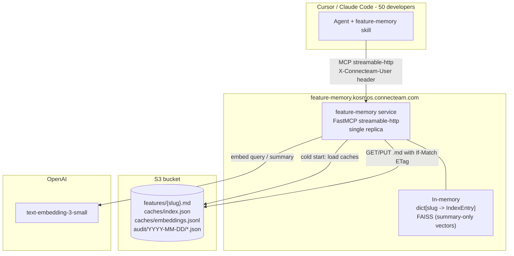

# Feature Memory V2 — Hosted Service (S3 + FAISS)

**Status:** SUPERSEDED by [V3 (S3 Vectors + Bedrock)](./2026-05-12-feature-memory-v3-s3-vectors.md). V2 was never deployed to production; we pivoted to V3 before the kosmos rollout after discovering Amazon S3 Vectors. Kept for context on the FAISS-in-RAM design we evaluated.
**Author:** Rafael Sakera
**Date:** 2026-05-12
**Supersedes:** [2026-04-23 V1 local MCP design](./2026-04-23-feature-memory-mcp-design.md) for the team-distribution use case. V1 stdio mode continues to work for single-user local development.

## 1. Why

V1 was a local-only MCP server reading and writing markdown files on a
developer's machine. It worked great as a personal context cache, but had
three structural problems for a 50-developer rollout:

1. **No sharing.** Each developer had their own copy of `features/`. The
   moment two people wrote a feature on the same area, the two memories
   diverged silently.
2. **Linear index.** `list_features` returned the entire `index.json` and
   the agent picked manually. At ~10 features this was fine; at 500 it
   would blow the agent's context budget on every auto-detect call.
3. **No audit / no concurrency control.** Two parallel `update_feature`
   calls on the same slug would clobber each other; nothing recorded who
   did what.

V2 makes the service shared, searchable, concurrent-safe, and auditable
without changing the agent-facing skill ergonomics.

## 2. Architecture



## 3. Module map

| Module        | Role                                                              |
| ------------- | ----------------------------------------------------------------- |
| `models.py`   | Pydantic schemas (incl. `Config`, `BlobMetadata`).                |
| `storage.py`  | `Storage` protocol + `LocalFSStorage` + `S3Storage` + `write_with_retry`. |
| `search.py`   | `Embedder` (OpenAI) + `FAISSIndex` (in-memory cosine).            |
| `audit.py`    | `append(...)` writes a tiny JSON blob per mutating call.          |
| `index.py`    | `MemoryIndex` (in-memory state) + legacy V1 disk helpers.         |
| `store.py`    | Markdown parse/serialize. Unchanged from V1.                      |
| `merge.py`    | `FeaturePatch` -> `Feature` merge. Unchanged from V1.             |
| `correction.py` | Surgical corrections. Unchanged from V1.                        |
| `server.py`   | FastMCP wiring. New: HTTP transport, `search_features`, storage-routed mutations, header-based author resolution. |
| `scripts/migrate_to_s3.py` | One-shot V1->V2 migration.                            |

## 4. Storage layout

All paths are prefixed by `S3_PREFIX` (e.g. `prod/`).

| Path                                 | Purpose                                                                 | Mutability      |
| ------------------------------------ | ----------------------------------------------------------------------- | --------------- |
| `features/{slug}.md`                 | Canonical feature memory. **Source of truth.**                          | Conditional PUT |
| `features/_archived/{slug}.md`       | Archived features (soft-delete). Read-only after archive.               | Unconditional   |
| `caches/index.json`                  | Frontmatter array. Speeds cold-start `list_features`.                   | Derived         |
| `caches/embeddings.jsonl`            | `{slug, vector}` lines for FAISS warm-up.                               | Derived         |
| `audit/YYYY-MM-DD/{HHMMSS}-{u8}.json`| One JSON blob per mutating call. Forensic-only.                         | Append-only     |

Derived caches are rebuilt by the server, debounced by `CACHE_DEBOUNCE_SECONDS`
(default 60). The .md files alone are sufficient to reconstruct everything;
losing the caches just means a longer cold start.

## 5. Concurrency model

```mermaid
sequenceDiagram
    participant A as Cursor agent
    participant S as feature-memory service
    participant M as In-memory state
    participant B as S3 bucket

    A->>S: update_feature(slug, patch)
    S->>B: GET features/{slug}.md (captures ETag)
    S->>S: apply_patch (existing merge.py)
    S->>B: PUT features/{slug}.md If-Match: <etag>
    alt 412 PreconditionFailed
        S->>B: GET fresh .md
        S->>S: re-apply patch (additive merge is conflict-free)
        S->>B: PUT with new ETag (retry up to 3x)
    end
    S->>S: re-embed summary
    S->>M: dict[slug]=new_entry; faiss.remove+add(slug)
    S->>B: append audit/.../{uuid}.json
    S-->>A: UpdateResult{ok, diff, warnings}
    Note over S,B: debounced (60s): PUT caches/index.json + embeddings.jsonl
```

Single-replica V1 means the in-memory FAISS index is automatically consistent
with what's on S3 (we write S3 first, then mutate memory). Multi-replica
HA in V2.1 will need S3 EventBridge -> SNS fan-out so each replica
invalidates its in-memory state on writes from siblings.

## 6. Search

Embedding text per feature is `summary + " " + name + " " + " ".join(tags)`.
We **do not embed the body.** Two reasons:

- Body content varies wildly in length and structure; tags+summary are the
  highest-signal text per feature.
- Smaller vectors = faster cold start, cheaper OpenAI API usage, simpler
  index management. At ~5K features, the whole index is ~30MB RAM.

`search_features(query, k)` returns up to k `{slug, name, summary, score}`
hits. The agent then calls `get_feature(slug)` for the full body. No body
content ever leaves the box other than back to the requesting agent.

## 7. Author attribution

The agent can't be trusted to attribute its own writes correctly. Two
mitigations:

1. **Header-based override.** If `AUTH_HEADER` is set (e.g.
   `X-Connecteam-User`), the server reads that header from the incoming
   HTTP request and overwrites `patch.last_update.author` with the value.
   Kosmos ingress is responsible for stamping this header from the verified
   user identity.
2. **Audit blob includes resolved actor.** Even if the override fails to
   activate for some reason, the audit log records the actor the server
   actually believed it was talking to.

Defense in depth: if the header is missing, we fall back to the agent's
self-attribution rather than 401-ing the request. This prevents a misconfig
from black-holing all writes; the audit trail still shows the actor.

## 8. Tool surface

| Tool               | Read/Write | Notes                                              |
| ------------------ | ---------- | -------------------------------------------------- |
| `list_features`    | Read       | Powered by in-memory `MemoryIndex`. Free.          |
| `search_features`  | Read       | NEW in V2. Cosine over FAISS. Sub-100ms.           |
| `get_feature`      | Read       | GET .md from storage.                              |
| `create_feature`   | Write      | Unconditional PUT (new slug guaranteed unique).    |
| `update_feature`   | Write      | Conditional PUT with `If-Match` ETag, 3x retry.    |
| `correct_feature`  | Write      | Same write path as update.                         |
| `archive_feature`  | Write      | Last write + copy + delete.                        |

## 9. Out of scope for V2

Parked for later iterations (V2.x):

- Multi-replica HA (S3 EventBridge -> SNS for cache invalidation).
- Per-team / per-repo namespacing inside the same bucket.
- DeepWiki sidecar for `key_paths` suggestions on `create_feature`.
- Quality validation rules (length caps, anti-commit-noise regex).
- Audit query API / read dashboard.
- Fuzzy-match-before-create against existing features.
- Staleness checks via GitHub API on `key_paths`.

## 10. Rollout plan

1. Push V1 code to the new GitHub repo (done).
2. Build all V2 modules in-place, keep V1 stdio working (done).
3. Migration script tested against moto + real bucket (mock validated end-to-end).
4. Hand `Dockerfile` + `docs/operations/env-vars.md` to DevOps.
5. DevOps provisions the bucket, the kosmos service, and the `X-Connecteam-User`
   ingress stamp. Run `feature-memory-migrate` once to seed S3.
6. Package the skill + `mcp.json` (pointing at the live HTTPS URL) as a
   Connecteam plugin.
7. Team admin merges the plugin PR; marketplace pushes to all 50 devs.
8. Two-week soak; observe audit logs for write velocity and any conflict
   storms. Tune `CACHE_DEBOUNCE_SECONDS` if needed.

## 11. Risk register

| Risk                                          | Mitigation                                                         |
| --------------------------------------------- | ------------------------------------------------------------------ |
| DevOps prefers persistent volume over S3      | `Storage` protocol abstracts both. Single env-var flip.            |
| Auth header missing on some kosmos routes     | Fall back to agent self-attribution; audit shows actor regardless. |
| OpenAI outage                                 | `search_features` returns `[]`; reads/writes unaffected.           |
| Concurrent writes from two devs               | `If-Match` ETag + 3x retry; additive merge is conflict-free.       |
| Cache rewrite storm                           | 60s debounce window bounds S3 PUT rate.                            |
| Single replica = ~5s restart downtime         | Acceptable for V1; rolling restart off-hours.                      |
| Migration script bug overwrites valid data    | Idempotent (sha256 == ETag for unchanged files); dry-run flag.     |
