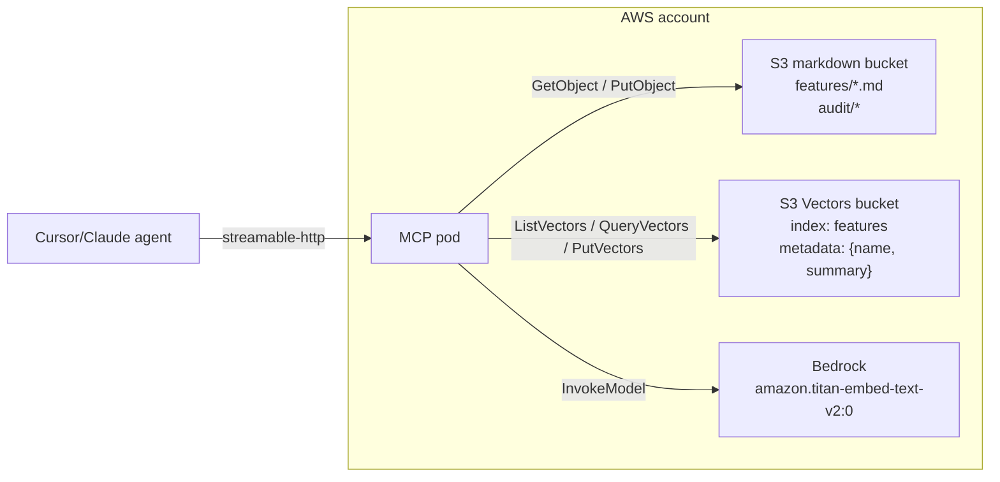

# Feature Memory V3 - S3 Vectors + Bedrock

**Status**: Active. Supersedes [V2](2026-05-12-feature-memory-v2-hosted.md).
**Author**: Rafael Sakera, with input from Oren Haliva (S3 Vectors recommendation).
**Date**: 2026-05-12 (initial), 2026-05-13 (stateless follow-up).

## Summary

V3 pivots away from FAISS-in-RAM + OpenAI embeddings to a fully AWS-native
stack: **Amazon S3 Vectors** for the vector index and **AWS Bedrock Titan
Text Embeddings v2** for the embedding model. The server is **fully stateless**:
no in-process vector cache, no in-RAM index dict, no debounced flush, no
cold-start re-embed, no `caches/index.json`. Every read tool hits S3 / S3
Vectors directly; every write tool issues exactly one markdown PUT and one
PutVectors call.

This is a net deletion across both V2 -> V3 and the in-flight stateless
follow-up: ~450 lines removed, ~250 added, fewer moving parts, one fewer
external vendor.

## Why

V2 worked but carried real architectural complexity:

1. **In-process FAISS** meant every server pod had its own copy of the vector
   index. Multi-instance coherence relied on a debounced flush to S3 + a
   reload-on-cache-miss path. Workable, but easy to get wrong.
2. **Embeddings cache (`caches/embeddings.jsonl`)** existed only to avoid
   re-embedding all features on every pod restart. Pure infrastructure tax.
3. **OpenAI as the embedding vendor** was an extra security review surface
   (one more key to rotate, one more legal contract) when the team is
   already an AWS shop.
4. **In-RAM `IndexEntry` dict + `caches/index.json`** existed to keep
   `list_features` cheap. But S3 Vectors `ListVectors(returnMetadata=true)`
   already returns the same shape from the same store the writer just hit,
   so the cache was redundant the moment we picked S3 Vectors.

S3 Vectors collapses (1), (2), and (4): the index lives in S3, every pod
reads the same view, restart is free, and there is no separate "list cache"
to keep in sync. Bedrock collapses (3): same IAM, same billing, same audit
trail as the rest of our AWS surface.

The cost is per-query latency: FAISS was sub-millisecond, S3 Vectors is
~100-300ms over the network. Inside an agent flow (where the chat LLM is
already the long-tail latency) this is invisible. We are not building a hot
path for end users; we are building an agent-side knowledge base.

## Architecture



The pod is stateless. There are no in-memory caches, no warmup, no
background tasks. Cold start = process start = ready to serve.

### Module map

| Module | V2 | V3 |
|---|---|---|
| `models.py` Config | `openai_api_key`, `openai_model`, `embedding_dim`, `cache_debounce_seconds` | `s3_vector_bucket`, `s3_vector_index_name`, `s3_vector_region`, `bedrock_region`, `bedrock_model_id`, `embedding_dim=1024` |
| `search.py` `Embedder` | OpenAI `text-embedding-3-small`, 1536-dim | Bedrock Titan v2, 1024-dim |
| `search.py` `FAISSIndex` | In-process IndexIDMap over IndexFlatIP | **Deleted** |
| `search.py` `S3VectorsIndex` | n/a | **New**: thin boto3 `s3vectors` wrapper with `upsert/delete/query/list_all` |
| `index.py` `MemoryIndex` | FAISS + debouncer + dual-cache flush | **Deleted** |
| `index.py` `_Debouncer` | Coalesces cache writes | **Deleted** |
| `index.py` `EMBEDDINGS_FILENAME` | `embeddings.jsonl` | **Deleted** |
| `index.py` legacy `build_index/read_index/write_index` | V1 disk helpers | Kept for V1/stdio path only |
| `server.py` | Wires FAISS + OpenAI + MemoryIndex | Wires S3VectorsIndex + Bedrock Embedder directly into tools (no MemoryIndex) |
| `server.py` `list_features` return | Full `IndexEntry` from in-RAM dict | Slim `{slug, name, summary}` from `ListVectors` |
| `server.py` `search_features` return | Full `IndexEntry` + score | Slim `{slug, name, summary, score}` from `QueryVectors(returnMetadata=true)` |
| `scripts/migrate_to_s3.py` | Writes embeddings.jsonl cache + index.json | Writes vectors to S3 Vectors only |
| `Dockerfile` | Installs `libgomp1` for FAISS | No native deps |
| `pyproject.toml` | `faiss-cpu`, `openai` | Just `boto3>=1.40` |

## Storage layout

### Markdown bucket (regular S3)

```
features/{slug}.md
features/_archived/{slug}.md
audit/YYYY-MM-DD/*.json
```

Both `caches/embeddings.jsonl` and `caches/index.json` are **gone**.
Embeddings live in S3 Vectors. The "list of all features" view also lives
in S3 Vectors (via `ListVectors` with `returnMetadata=true`). The markdown
bucket holds only canonical .md content and the audit log.

### Vector bucket (Amazon S3 Vectors)

```
{vector_bucket}/
  features/                  # one index, name="features"
    vectors keyed by {slug}
      data: float32[1024]
      metadata: {name, summary}    # slim - everything else lives in .md
```

Index config: `dataType=float32, dimension=1024, distanceMetric=cosine`.

The metadata blob is deliberately small (~150 bytes per feature). It's the
preview that `list_features` and `search_features` show; agents that need
tags, key_paths, parent_feature, or body content call `get_feature(slug)`
and read the .md from the markdown bucket. This keeps the index light and
the source of truth (the .md file) authoritative.

## Concurrency model

V2 used `If-Match` ETags on the markdown bucket + a debouncer for the embeddings
cache. V3 keeps the markdown ETag flow (unchanged - that's a `Storage` concern,
not search) and **removes the debouncer entirely**.

S3 Vectors `PutVectors` has upsert semantics keyed by `(bucket, index, key)`.
Concurrent writes for the same slug are last-writer-wins on the vector side -
acceptable, because the markdown write goes first under an ETag, so a stale
agent that loses the markdown race also doesn't get to write its embedding.

## Author attribution

Unchanged from V2: the server reads the `X-Connecteam-User` header (configurable
via `AUTH_HEADER`) and overrides `patch.last_update.author` server-side so the
agent cannot self-attribute.

## Tool surface

Same set of tools as V2, but `list_features` and `search_features` return
slimmer payloads (slug + name + summary instead of full IndexEntry):

- **`list_features`** -> `[{slug, name, summary}]`. One paginated
  `ListVectors(returnMetadata=true)` call. ~150-300ms total at our scale.
- **`search_features`** -> `[{slug, name, summary, score}]`. One Bedrock
  `InvokeModel` + one `QueryVectors(returnMetadata=true)`. ~200-400ms total.
- **`get_feature`** -> full frontmatter + body_markdown. One S3 `GetObject`.
  This is where agents go when they need tags, key_paths, body content, etc.
- **`create_feature` / `update_feature` / `correct_feature`** -> one S3
  PutObject (under If-Match for update/correct) + one Bedrock invoke + one
  PutVectors. All synchronous, no queues.
- **`archive_feature`** -> one CopyObject + one DeleteObject + one
  DeleteVectors.

`search_features` scores come from S3 Vectors' cosine distance converted
to similarity (`1 - distance`). Treat scores <0.3 as weak matches.

The contract shrink for `list_features` / `search_features` is intentional:
the agent's flow is "list/search to find a slug, then `get_feature(slug)`
for the full payload". V2's `list_features` shoved tags+key_paths into the
list response on the off chance the agent could short-circuit. In practice
agents almost always followed up with `get_feature` anyway, so the extra
metadata was dead weight. If a future flow ever needs tag-filtered listing,
S3 Vectors supports metadata filters on `ListVectors` and we can wire that
through without changing the wire shape.

## Environment contract

| Env var | Required when | Purpose |
|---|---|---|
| `STORAGE_BACKEND=s3` | Always (V3 path) | Enables the AWS backend |
| `S3_BUCKET` | `STORAGE_BACKEND=s3` | Markdown bucket name |
| `AWS_REGION` | `STORAGE_BACKEND=s3` | Default region for all AWS clients |
| `S3_VECTOR_BUCKET` | Search enabled | Vector bucket name |
| `S3_VECTOR_INDEX_NAME` | optional | Defaults to `features` |
| `S3_VECTOR_REGION` | optional | Override if vector bucket is in a different region |
| `BEDROCK_REGION` | optional | Override (e.g. `us-east-1` if Titan v2 isn't in your S3 region) |
| `BEDROCK_MODEL_ID` | optional | Defaults to `amazon.titan-embed-text-v2:0` |
| `EMBEDDING_DIM` | optional | Defaults to 1024; must match the vector index |
| `AUTH_HEADER` | HTTP mode | Server-side author override |
| `MCP_TRANSPORT`, `MCP_HOST`, `MCP_PORT` | HTTP mode | |
| `AWS_ACCESS_KEY_ID`, `AWS_SECRET_ACCESS_KEY` | local dev only | Pod uses IAM role |

If `S3_VECTOR_BUCKET` is unset, the server still boots, list/get/create/update
all work, and `search_features` returns `[]` (with a startup warning). This is
the local/dev fallback - nobody runs prod this way.

## Rollout plan

1. Merge V3 PR to `main` on the upstream feature_memory repo.
2. DevOps provisions:
   - One **vector bucket** per env (`dev.connecteam.feature-memory-vectors`,
     `prod.connecteam.feature-memory-vectors`), with the same tag taxonomy as
     the existing markdown buckets.
   - One **vector index** inside each: `features`, dim=1024, metric=cosine.
   - **Bedrock model access** enabled for `amazon.titan-embed-text-v2:0` in
     the target region. (This is per-account, one-time, via the AWS Console.)
   - IAM grants for the kosmos pod's role: `s3vectors:PutVectors`,
     `s3vectors:QueryVectors`, `s3vectors:DeleteVectors`, plus the existing S3
     grants and `bedrock:InvokeModel` for the Titan model ARN.
3. Run `feature-memory-migrate` against dev, smoke-test from Cursor.
4. Run against prod, deploy V3 image, smoke-test the hosted endpoint.
5. Bump plugin to 3.0.0 in `Connecteam/plugins`. Marketplace rolls out to devs.

## Risk register

| Risk | Mitigation |
|---|---|
| Bedrock Titan v2 unavailable in target region | `BEDROCK_REGION` env var lets us point at `us-east-1` even if S3 is in `eu-central-1`. Cross-region traffic is small per-call (1KB) so latency penalty is negligible. |
| moto doesn't fully support `s3vectors` yet | Tests use in-process fakes (Protocol-stubbed clients), so moto coverage is irrelevant for the vector path. |
| S3 Vectors per-query latency (100-300ms) | Confirmed acceptable inside agent flow. If we ever build a UI hot-path, revisit (could add a tiny local LRU). |
| S3 Vectors quotas (TPS, vector count) | We're at ~12 features, ceiling is millions of vectors. Years of headroom. |
| Bedrock cost | Titan v2 = $0.00002 per 1K tokens. ~$5/month at 50 devs × 100 searches/day. Trivial. |
| Bedrock model access not pre-approved | DevOps handoff explicitly calls this out. One Console toggle. |

## Out of scope for V3

- Hybrid search (BM25 + vectors)
- Metadata filtering on `query_vectors` (supported by S3 Vectors; we'll wire
  it when a real use case appears, e.g. "search only within tag=X")
- Multi-region replication of the vector bucket
- Provider abstraction. We have one backend (Bedrock + S3 Vectors). If we
  later need a second, we'll add a `Protocol` seam at that point.
- LocalStack support for the vector path. LocalStack community doesn't
  implement `s3vectors`. Local dev uses a real shared dev vector bucket.

## Deleted from V2

For posterity, V3 deletes:

- `src/feature_memory/search.py`: `FAISSIndex` class (~150 lines)
- `src/feature_memory/index.py`: `_Debouncer` class, `EMBEDDINGS_FILENAME` constant, embeddings-cache hydration branches (~80 lines), and the entire `MemoryIndex` class (~120 lines)
- `src/feature_memory/server.py`: lifespan flush, in-RAM `IndexEntry` projection cached across calls, `memory_index` parameter on `build_server` (~40 lines)
- `caches/index.json`: written by V2 migration, written-and-flushed at runtime by V2 server. Gone in V3.
- `pyproject.toml`: `faiss-cpu`, `openai` dependencies
- `Dockerfile`: `libgomp1` system package
- `docs/operations/localstack.md`: still useful for the markdown-only flow but no longer covers the full end-to-end path; marked historical
